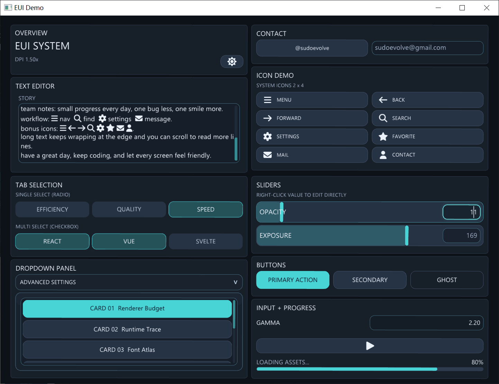
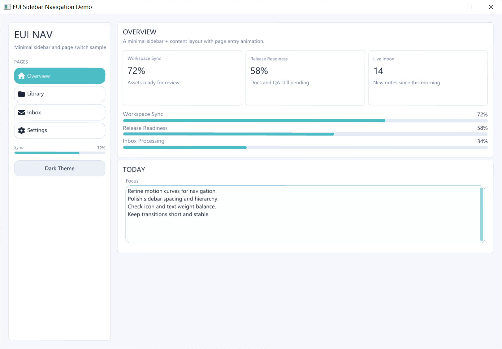
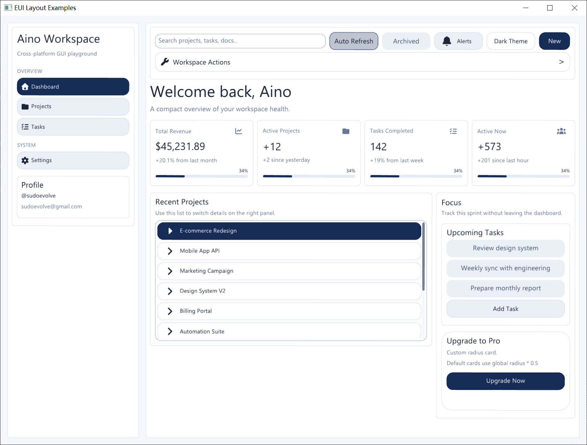
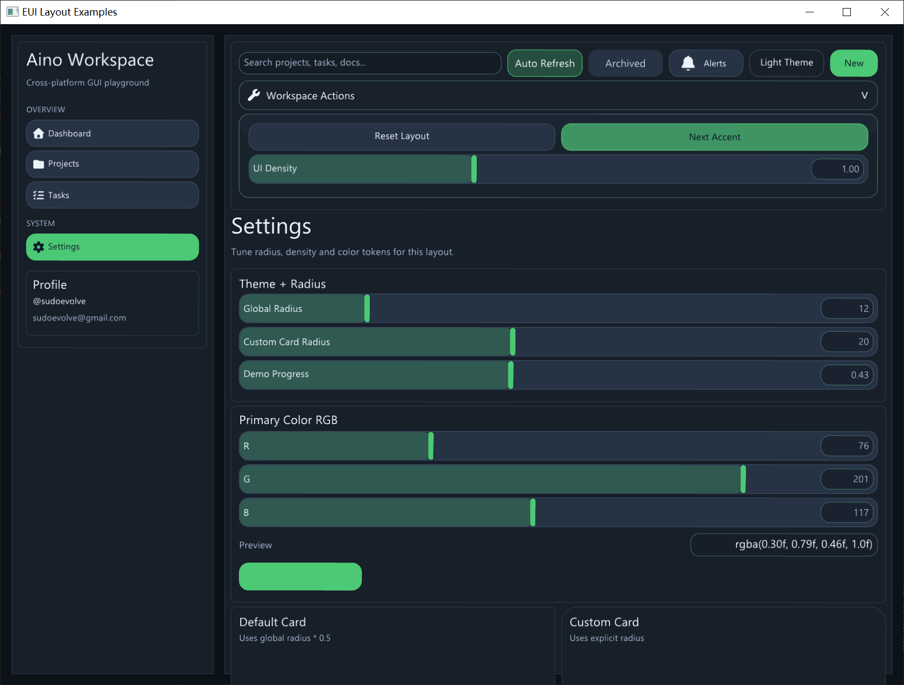

# EUI Docs

This directory is intentionally small.

## Preview

<table>
  <tr>
    <td></td>
    <td></td>
    <td></td>
  </tr>
  <tr>
    <td></td>
    <td></td>
    <td></td>
  </tr>
</table>

Current recommended reading order:

1. `quick-ui-tutorial.zh-CN.md`
2. `modern-gl-roadmap.zh-CN.md`
3. `project-structure.zh-CN.md`

Current repo decisions:

- The public OpenGL route stays `EUI_BACKEND_OPENGL`.
- `GLFW` and `SDL2` share the same modern GL renderer path.
- `EUI_OPENGL_ES` is treated as a compatibility branch under the OpenGL route.
- `Vulkan` is still not implemented.

The older issue/checklist/proposal/status documents were removed because they mostly described planning stages that are no longer the current source of truth.
